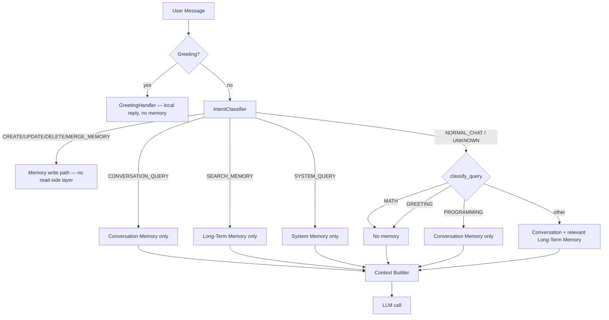

# Phase 9 — Hierarchical Memory Architecture

Aetheris separates memory into three independent layers. The Cognitive
Request Router (CRR) picks exactly one layer (or none) per request — layers
are never combined unless the query genuinely needs both conversation
context and user facts (`NORMAL_CHAT`).

## Layers

| Layer | Class | Storage | Lifetime | Purpose |
|---|---|---|---|---|
| Short-Term Conversation Memory | `ConversationMemory` (`backend/app/services/conversation_memory.py`) | In-process, per session | Cleared on session reset | Current conversation only (default 20 exchanges) |
| Long-Term User Memory | `MemoryService` (`backend/app/services/memory_service.py`) | ChromaDB | Persists across sessions | Durable user facts (name, preferences, project, etc.) |
| System Memory | `SystemMemory` (`backend/app/services/system_memory.py`) | In-process, static | Read-only, never edited by user commands | Aetheris's own identity/capabilities |

`MemoryHierarchyService` (`backend/app/services/memory_hierarchy_service.py`)
owns all three and decides which one(s) a given request may read.

## Diagram

## Routing logic per query type

| Query type | Example | Intent | Memory layer used |
|---|---|---|---|
| Short-term / conversation query | "What was our previous conversation?" | `CONVERSATION_QUERY` | Conversation only |
| Long-term / memory query | "What is my favorite language?" | `SEARCH_MEMORY` | Long-term only |
| System / identity query | "Who are you?" | `SYSTEM_QUERY` | System only |
| Math | "8 × 9?" | `NORMAL_CHAT` → `classify_query` = `MATH` | None |
| Greeting | "hi" | short-circuited before classification | None |
| Programming | "Debug this Python function" | `NORMAL_CHAT` → `classify_query` = `PROGRAMMING` | Conversation only |
| General chat | anything else | `NORMAL_CHAT` | Conversation + relevant long-term facts |

`IntentType` (`backend/app/schemas/routing.py`) only distinguishes
conversation/long-term/system/memory-write intents at the router level; it
has no `MATH`/`GREETING`/`PROGRAMMING` members. Those finer distinctions are
resolved a level down, inside `MemoryHierarchyService`, via
`classify_query()` (`backend/app/services/conversation_context_filter.py`),
which is also what the context-relevance filter uses for scoring.

## Sessions

`ConversationMemory` holds a single active `ConversationSession`
(`id`, `created_at`, `last_activity`, `history`). `POST /api/session/reset`
starts a new session — conversation history is cleared, long-term memory is
untouched. `ConversationMemory` is a process-wide singleton
(`@lru_cache` in `backend/app/dependencies.py`), so history now correctly
persists between chat turns within a session instead of being rebuilt on
every request.

## Isolation guarantees

- Conversation Memory is never embedded into ChromaDB — it lives only in
  the `ConversationMemory` singleton.
- Long-Term Memory is only queried for `SEARCH_MEMORY` and `NORMAL_CHAT`
  (and only the latter also mixes in conversation history).
- System Memory is only read for `SYSTEM_QUERY` and is never mutated by
  `CREATE_MEMORY` / `UPDATE_MEMORY` / `DELETE_MEMORY` — those all write to
  `MemoryService` / ChromaDB.

## Dashboard

`GET /api/debug/memory-hierarchy` returns:

- `conversation_memory` — current session info + recent messages
- `long_term_memory` — storage description
- `system_memory` — static facts
- `memory_isolation` — isolation guarantees (informational)
- `last_resolution` — the memory layer, message/memory counts, context
  text and timing from the most recent `MemoryHierarchyService.resolve()`
  call (the layer actually selected, not just what's theoretically
  available)

## What Phase 9 fixed

The hierarchy classes described above already existed in the codebase, but
two bugs meant they weren't actually working:

1. **`MemoryHierarchyService.resolve()` referenced non-existent
   `IntentType.MATH` / `IntentType.GREETING` / `IntentType.PROGRAMMING`
   members.** Since `IntentType` never defined those, every `NORMAL_CHAT`
   message (the majority of traffic) raised `AttributeError`, which the
   router's outer `try/except` swallowed and silently fell back to the old
   flat ChromaDB search across all memories — exactly the "old long-term
   memories leak into simple conversations" symptom described in the Phase
   9 problem statement. Fixed by routing math/greeting/programming
   detection through `classify_query()` instead.
2. **`get_conversation_memory()` / `get_system_memory()` were not cached
   singletons**, so FastAPI built a fresh, empty `ConversationMemory` on
   every request. Conversation history never survived between turns, so
   "what was our previous conversation?" could never find anything. Fixed
   with `@lru_cache(maxsize=1)`.
3. **`_handle_system_query` and `_handle_search_memory` in
   `CognitiveRequestRouter` bypassed `MemoryHierarchyService` entirely**
   and called the old flat ChromaDB search — meaning "Who are you?" could
   pull in unrelated user facts, violating the System Memory isolation
   rule. Both handlers now route through `MemoryHierarchyService`.
4. Added `POST /api/session/reset` — the session-reset deliverable had no
   API surface even though `ConversationMemory.reset_session()` existed.
